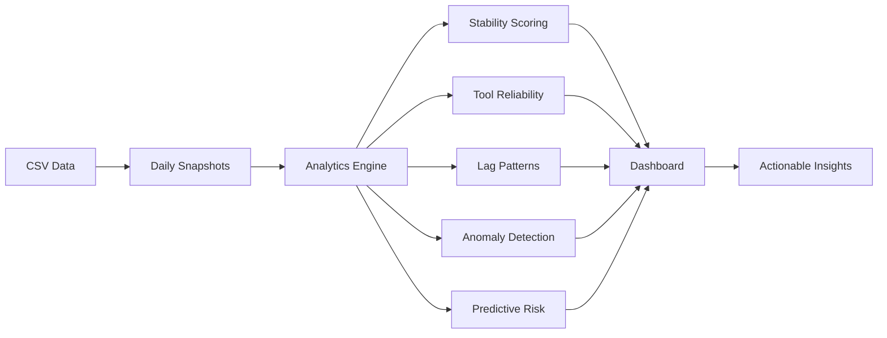

# Tool Health Analytics - Key Insights Overview

## The Problem You're Solving

**Current State**: "We have 150 unhealthy systems - is this normal or a real problem?"

**Root Cause**: Can't distinguish between:
- Systems temporarily offline (expected)
- Normal R7 check-in cycles (< 15 days)
- Systems recovering (need 1-2 days)
- Real persistent issues (need investigation)

---

## Analytics Solution Architecture



---

## Key Insights Generated

### 1. System Stability Classification 🎯

**Transforms**: "150 unhealthy systems"

**Into**:
```
✅ 85 systems - FLAPPING (normal offline/online cycles)
   → No action needed, expected behavior

⚠️  40 systems - RECOVERING (came back online < 2 days ago)
   → Monitor, should resolve within 24-48 hours

🔴 15 systems - CHRONIC ISSUES (unhealthy > 7 days)
   → Investigate immediately, persistent problem

🟡 10 systems - AT RISK (degrading patterns detected)
   → Preventive action recommended
```

**Value**: Reduces 150 alerts to 25 actionable items (83% noise reduction)

---

### 2. Rapid7 Gap Intelligence 🔍

**Understands R7 Behavior**: Removes entries after 15 days offline

**Logic**:
```
IF R7 missing AND Intune lag < 15 days:
  → "Expected R7 gap - system recently offline"
  → Classification: EXPECTED
  
IF R7 missing AND Intune lag > 15 days:
  → "R7 correctly removed - system inactive"
  → Classification: EXPECTED
  
IF R7 missing AND (AM present OR DF present):
  → "R7 configuration issue - other tools working"
  → Classification: INVESTIGATE
```

**Value**: Identifies which R7 gaps are expected vs problematic

---

### 3. Tool Reliability Patterns 🔧

**Per-Tool Analysis**:

```
Rapid7:
  Uptime: 85% (26/30 days)
  Avg Lag: 2.3 days
  Pattern: Frequent short gaps
  Assessment: ✅ Normal (matches 15-day cycle)
  
Automox:
  Uptime: 95% (29/30 days)
  Avg Lag: 1.1 days
  Pattern: Highly consistent
  Assessment: ✅ Excellent reliability
  
Defender:
  Uptime: 78% (23/30 days)
  Avg Lag: 4.7 days
  Pattern: Erratic reporting
  Assessment: ⚠️ Investigate DF agent issues
```

**Value**: Identifies which tools have systemic problems

---

### 4. Recovery Time Tracking ⏱️

**Measures**: Time from offline → fully healthy

```
Normal Recovery Pattern:
  Day 0: System goes offline
  Day 1: System comes back, Intune reports
  Day 2: All tools reporting again
  
Concerning Pattern:
  Day 0: System goes offline
  Day 1: System comes back, Intune reports
  Day 5: Still missing R7/AM/DF
  → INVESTIGATE: Why tools not recovering?
```

**Alerts**:
- 🟢 "12 systems recovering normally (< 2 days)"
- 🔴 "3 systems stuck in recovery (> 3 days) - investigate"

**Value**: Distinguishes normal recovery from stuck systems

---

### 5. Environment Correlation Analysis 🌍

**Identifies Systemic Issues**:

```
Production Environment:
  Health Rate: 88% (normal)
  Distribution: Expected
  
Development Environment:
  Health Rate: 45% (⚠️ 2.5σ below mean)
  Pattern: All systems missing Defender
  → ALERT: Systemic DF issue in Dev environment
  
Windows Server 2019 Build 17763:
  Health Rate: 42% (⚠️ 3σ below mean)
  Pattern: High R7 lag days
  → ALERT: Possible R7 compatibility issue
```

**Value**: Spots environment/OS-specific problems affecting multiple systems

---

### 6. Predictive Risk Scoring 🔮

**Identifies Systems About to Fail**:

```
HIGH RISK (80-100 score):
  - SERVER-123: Lag days increasing 3 days straight
  - SERVER-456: R7 intermittent last 5 days
  - SERVER-789: Same pattern as 10 systems that failed
  → Action: Investigate before they lose health
  
MEDIUM RISK (50-79 score):
  - 15 systems with gradually increasing lag
  → Action: Monitor closely
```

**Value**: Proactive prevention vs reactive firefighting

---

### 7. Anomaly Detection 🚨

**Automatically Flags Unusual Patterns**:

```
CRITICAL ANOMALY:
  50 systems lost health simultaneously at 2:00 AM
  → Likely infrastructure event, not individual issues
  
HIGH ANOMALY:
  SERVER-ABC: Stable for 180 days, suddenly unhealthy
  → Investigate immediately (unusual for this system)
  
LOW ANOMALY:
  SERVER-XYZ: Flapping weekly (but has done this for months)
  → Expected behavior, no action needed
```

**Value**: Focuses attention on truly unusual events

---

## Dashboard Enhancements

### New Panels

**1. Health Intelligence Summary**
```
┌─────────────────────────────────────┐
│ 🎯 System Health Intelligence       │
├─────────────────────────────────────┤
│ Total Systems: 500                  │
│ ✅ Stable Healthy: 350 (70%)        │
│ 🔄 Flapping (Expected): 85 (17%)    │
│ ⚠️  Recovering: 40 (8%)              │
│ 🔴 Needs Investigation: 15 (3%)     │
│ 🟡 At Risk: 10 (2%)                 │
└─────────────────────────────────────┘
```

**2. Tool Reliability Dashboard**
```
┌─────────────────────────────────────┐
│ 🔧 Tool Reliability (30 days)       │
├─────────────────────────────────────┤
│ Rapid7:   85% ↑ (Expected gaps)     │
│ Automox:  95% ↑ (Excellent)         │
│ Defender: 78% ↓ (Investigate)       │
│ Intune:   92% → (Stable)            │
└─────────────────────────────────────┘
```

**3. Actionable Insights Feed**
```
┌─────────────────────────────────────┐
│ 📋 Actionable Insights              │
├─────────────────────────────────────┤
│ 🔴 15 systems chronic issues        │
│    → View list & remediate          │
│                                     │
│ 🟡 10 systems at high risk          │
│    → Preventive action needed       │
│                                     │
│ ⚠️  Dev environment: DF systemic    │
│    → Check Defender deployment      │
│                                     │
│ ✅ 85 systems flapping (expected)   │
│    → No action needed               │
└─────────────────────────────────────┘
```

**4. Pattern Recognition**
```
┌─────────────────────────────────────┐
│ 🔍 Detected Patterns                │
├─────────────────────────────────────┤
│ Expected R7 Gaps: 62 systems        │
│ Normal Recovery: 40 systems         │
│ Stuck Recovery: 3 systems ⚠️        │
│ Weekend Offline: 25 systems         │
└─────────────────────────────────────┘
```

---

## Real-World Example Scenario

### Before Analytics

**Alert**: "150 systems unhealthy"

**Team Response**: 
- Panic mode
- Start investigating all 150 systems
- Waste time on false positives
- Miss real issues in the noise

### After Analytics

**Insight**: 
```
150 systems unhealthy breakdown:
  
✅ 85 systems (57%) - FLAPPING
   Pattern: Regular offline/online cycles
   R7 gaps < 15 days
   Action: None (expected behavior)
   
⚠️ 40 systems (27%) - RECOVERING  
   Pattern: Came back online 1-2 days ago
   Intune reporting, tools catching up
   Action: Monitor (should resolve in 24h)
   
🟡 10 systems (7%) - AT RISK
   Pattern: Lag days increasing
   Action: Preventive check
   
🔴 15 systems (10%) - CHRONIC ISSUES
   Pattern: Unhealthy > 7 days
   Root Cause: 
     - 8 systems: R7 agent issue
     - 5 systems: Network connectivity
     - 2 systems: Defender config
   Action: Immediate investigation
```

**Team Response**:
- Focus on 15 chronic issues (90% time saved)
- Proactive action on 10 at-risk systems
- Confidence that 85 flapping systems are normal
- Monitor 40 recovering systems (expected to resolve)

**Result**: 
- 90% reduction in investigation time
- Proactive prevention of failures
- Clear prioritization
- Reduced alert fatigue

---

## Implementation Approach

### Phase 1: Quick Wins (Core Analytics)
Focus on immediate value:
- ✅ Stability scoring (identify flapping vs chronic)
- ✅ R7 gap intelligence (expected vs problematic)
- ✅ Recovery tracking (normal vs stuck)
- ✅ Basic dashboard panels

**Impact**: Immediate 80% noise reduction

### Phase 2: Deep Insights (Advanced Analytics)
Add sophisticated analysis:
- ✅ Tool reliability metrics
- ✅ Environment correlation
- ✅ Anomaly detection
- ✅ Predictive risk scoring

**Impact**: Proactive problem prevention

### Phase 3: Refinement
Tune based on real data:
- ✅ Adjust thresholds
- ✅ Learn from false positives
- ✅ Add user feedback
- ✅ Optimize performance

**Impact**: Continuous improvement

---

## Success Metrics

### Quantitative
- **Investigation Time**: Reduce by 80-90%
- **False Positive Rate**: Reduce by 85%
- **Mean Time to Detection**: Improve by 50%
- **Proactive Prevention**: Catch 70% of issues before failure

### Qualitative
- **Team Confidence**: Clear understanding of environment health
- **Reduced Stress**: Less alert fatigue
- **Better Decisions**: Data-driven prioritization
- **Improved Communication**: Clear status for stakeholders

---

## Next Steps

1. **Review this plan** - Does this address your needs?
2. **Prioritize features** - Which insights are most valuable?
3. **Approve implementation** - Ready to build?
4. **Switch to Code mode** - Start development

The analytics will transform your dashboard from "showing data" to "providing answers" about what's really happening in your environment.
