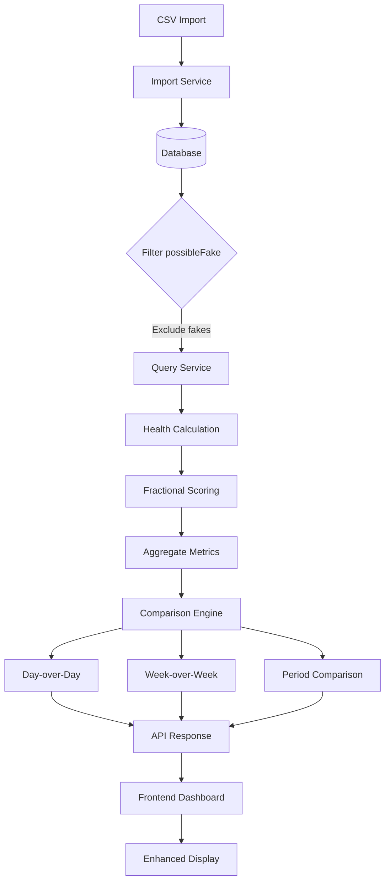
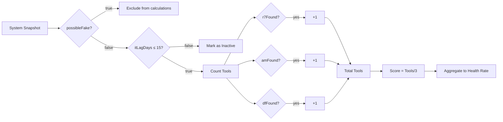

# Dashboard Improvements Plan

## Overview
This plan addresses critical issues with the health dashboard reporting and adds comprehensive trending capabilities to provide better insights into system health over time.

## Issues Identified

### 1. **Incorrect Health Rate Calculation**
- **Current Issue**: Health rate shows 99.7% with 5149 fully healthy and 1946 partially healthy systems
- **Root Cause**: Current calculation treats partially healthy systems as 100% healthy
- **Solution**: Implement fractional health scoring based on tool coverage

### 2. **Possible Fakes Skewing Data**
- **Current Issue**: Systems with `possibleFake=true` are included in health calculations
- **Root Cause**: No filtering applied in queries
- **Solution**: Exclude `possibleFake=true` from all health calculations and reporting

### 3. **Unclear Trending Context**
- **Current Issue**: "Systems Gained Health" and "Systems Lost Health" don't specify time period
- **Root Cause**: Calculations compare first day to last day of selected period without clear labeling
- **Solution**: Add explicit day-over-day and week-over-week comparisons with clear labels

### 4. **Missing Intune Check-in Information**
- **Current Issue**: Systems page doesn't show when systems last checked into Intune
- **Root Cause**: `itLagDays` field exists but not displayed in UI
- **Solution**: Add `itLagDays` display to Systems List showing last check-in time

### 5. **Insufficient Trending Insights**
- **Current Issue**: Limited visibility into trends and patterns
- **Root Cause**: Only shows cumulative data without comparison points
- **Solution**: Add multiple comparison views and tool-specific trending

---

## New Health Scoring Methodology

### Fractional Health Score Calculation

```
Health Score = (Number of Tools Reporting / 3) × 100%

Examples:
- 3/3 tools (R7 + AM + DF) = 100% (Fully Healthy)
- 2/3 tools = 66.7% (Partially Healthy)
- 1/3 tools = 33.3% (Partially Healthy)
- 0/3 tools = 0% (Unhealthy)
- Inactive in Intune = Excluded from health calculations
```

### Overall Health Rate Formula

```
Total Health Points = Σ(System Health Score for each active system)
Total Active Systems = Count of systems where itLagDays ≤ 15 AND possibleFake = false
Overall Health Rate = (Total Health Points / Total Active Systems) × 100%
```

---

## Architecture Changes

### Data Flow Diagram



### Health Calculation Flow



---

## Implementation Tasks

### Backend Changes

#### 1. Update Health Calculation Logic
**File**: `backend/src/modules/systems/systems.service.ts`

- Modify `getHealthTrending()` method:
  - Add `possibleFake` filter to all queries
  - Implement fractional health scoring
  - Calculate health points per system (0, 0.33, 0.67, 1.0)
  - Aggregate total health points and divide by active systems

#### 2. Add Comparison Endpoints
**File**: `backend/src/modules/systems/systems.controller.ts`

New endpoints:
- `GET /systems/health-trending/day-comparison` - Compare today vs yesterday
- `GET /systems/health-trending/week-comparison` - Compare today vs 7 days ago
- `GET /systems/health-trending/tool-trends` - Individual tool adoption trends

#### 3. Enhance Existing Endpoints
**File**: `backend/src/modules/systems/systems.service.ts`

Update `getHealthTrending()` response to include:
```typescript
{
  dateRange: { startDate, endDate, days },
  trendData: [...],
  summary: {
    totalSystemsNow: number,
    totalSystemsStart: number,
    healthImprovement: number,
    newSystemsDiscovered: number,
    systemsLostHealth: number,
    systemsGainedHealth: number,
    // NEW FIELDS
    dayOverDay: {
      healthRateChange: number,
      systemsChange: number,
      fullyHealthyChange: number,
      partiallyHealthyChange: number,
      unhealthyChange: number
    },
    weekOverWeek: {
      healthRateChange: number,
      systemsChange: number,
      fullyHealthyChange: number,
      partiallyHealthyChange: number,
      unhealthyChange: number
    },
    toolTrends: {
      r7: { current: number, change: number, trend: 'up'|'down'|'stable' },
      am: { current: number, change: number, trend: 'up'|'down'|'stable' },
      df: { current: number, change: number, trend: 'up'|'down'|'stable' },
      it: { current: number, change: number, trend: 'up'|'down'|'stable' }
    }
  }
}
```

#### 4. Update Systems List Query
**File**: `backend/src/modules/systems/systems.service.ts`

Modify queries to:
- Exclude `possibleFake=true` systems
- Include `itLagDays` in response data
- Add last check-in date calculation

---

### Frontend Changes

#### 1. Update Health Dashboard Component
**File**: `frontend/src/components/HealthDashboard.tsx`

Changes:
- Update summary cards to show comparison metrics
- Add day-over-day indicators (↑ +5.2% vs yesterday)
- Add week-over-week indicators (↑ +12.3% vs last week)
- Update health rate display with fractional scoring explanation
- Add tool-specific trending section

#### 2. Enhance Summary Cards
Add comparison badges to each metric:
```tsx
<div className="summary-card">
  <div className="card-value">{summary.totalSystemsNow}</div>
  <div className="card-comparison">
    <span className="day-change">↑ +5 vs yesterday</span>
    <span className="week-change">↑ +23 vs last week</span>
  </div>
</div>
```

#### 3. Add Tool Trending Section
New section showing individual tool adoption:
```tsx
<div className="tool-trending-section">
  <h3>Tool Adoption Trends</h3>
  <div className="tool-trend-cards">
    <ToolTrendCard tool="Rapid7" data={toolTrends.r7} />
    <ToolTrendCard tool="Automox" data={toolTrends.am} />
    <ToolTrendCard tool="Defender" data={toolTrends.df} />
    <ToolTrendCard tool="Intune" data={toolTrends.it} />
  </div>
</div>
```

#### 4. Update Systems List Component
**File**: `frontend/src/components/SystemsList.tsx`

Add Intune check-in information:
```tsx
<div className="system-card">
  <div className="system-shortname">{system.shortname}</div>
  <div className="intune-status">
    Last Intune check-in: {formatItLagDays(system.itLagDays)}
  </div>
</div>
```

#### 5. Update Type Definitions
**File**: `frontend/src/types/index.ts`

Add new types for comparison data and tool trends.

---

### UI/UX Enhancements

#### Comparison Indicators
- **Green ↑**: Positive change (improvement)
- **Red ↓**: Negative change (degradation)
- **Gray →**: No change (stable)

#### Time Period Labels
- "vs Yesterday" - Day-over-day comparison
- "vs Last Week" - Week-over-week comparison
- "Since [Start Date]" - Period comparison

#### Health Score Display
```
Health Rate: 72.5%
━━━━━━━━━━━━━━━━━━━━━━━━━━━━━━━━━━━━━━━━
Calculation:
• 5149 systems @ 100% (3/3 tools) = 5149 points
• 1946 systems @ 66.7% (2/3 tools) = 1298 points
• 523 systems @ 33.3% (1/3 tools) = 174 points
• 89 systems @ 0% (0/3 tools) = 0 points
━━━━━━━━━━━━━━━━━━━━━━━━━━━━━━━━━━━━━━━━
Total: 6621 points / 7707 active systems = 85.9%
```

---

## Data Filtering Rules

### Systems Excluded from Health Calculations
1. `possibleFake = true` - Fake/test systems
2. `itLagDays > 15` - Inactive in Intune (counted separately as "Inactive")
3. `itFound = false` - Not in Intune at all

### Active System Definition
A system is considered "active" if:
- `possibleFake = false` OR `possibleFake IS NULL`
- `itFound = true`
- `itLagDays <= 15`

---

## Testing Considerations

### Backend Testing
1. Verify `possibleFake` filtering in all queries
2. Validate fractional health score calculations
3. Test day-over-day comparison with edge cases (no data yesterday)
4. Test week-over-week comparison with edge cases (no data last week)
5. Verify tool trend calculations

### Frontend Testing
1. Verify comparison indicators display correctly
2. Test with various data scenarios (improvements, degradations, stable)
3. Validate health score explanation tooltip
4. Test responsive design for new sections
5. Verify Intune check-in display formatting

### Data Validation
1. Compare old vs new health rate calculations
2. Verify excluded systems count (possibleFake=true)
3. Validate trending direction indicators
4. Cross-check manual calculations with system output

---

## Migration Notes

### Breaking Changes
- Health rate percentage will change significantly due to fractional scoring
- Historical comparisons may show different values
- Systems count may decrease due to possibleFake filtering

### Communication Plan
1. Document the new health scoring methodology
2. Explain why health rate changed
3. Provide comparison of old vs new calculations
4. Update any external reports or dashboards

---

## Additional Enhancements

### Future Considerations
1. **Alerting**: Notify when health rate drops by X% day-over-day
2. **Forecasting**: Predict future health trends based on historical data
3. **Anomaly Detection**: Flag unusual patterns in tool reporting
4. **Export**: Allow exporting trending data to CSV/Excel
5. **Custom Time Ranges**: Allow users to select custom date ranges for comparison
6. **System-Level Trending**: Show individual system health history
7. **Tool-Specific Drill-Down**: Click tool trend to see affected systems

---

## Success Metrics

### Key Performance Indicators
1. **Accuracy**: Health rate reflects actual tool coverage
2. **Clarity**: Users understand what metrics mean and time periods
3. **Actionability**: Trending data helps identify issues quickly
4. **Performance**: Dashboard loads within 2 seconds
5. **Usability**: Users can easily compare different time periods

---

## Implementation Order

1. ✅ Backend: Add `possibleFake` filtering to all queries
2. ✅ Backend: Implement fractional health scoring
3. ✅ Backend: Add day-over-day comparison logic
4. ✅ Backend: Add week-over-week comparison logic
5. ✅ Backend: Add tool trending calculations
6. ✅ Backend: Update API responses with new data
7. ✅ Frontend: Update type definitions
8. ✅ Frontend: Update HealthDashboard component
9. ✅ Frontend: Add comparison indicators
10. ✅ Frontend: Add tool trending section
11. ✅ Frontend: Update SystemsList with itLagDays
12. ✅ Testing: Validate calculations
13. ✅ Testing: UI/UX testing
14. ✅ Documentation: Update user documentation
15. ✅ Deployment: Roll out changes

---

## Notes

- The 15-day Intune inactivity threshold is already defined in the code
- VMware is intentionally excluded from health calculations (only R7, AM, DF count)
- New systems discovered are tracked separately and may not have full tooling yet
- The system already has environment filtering capability that should be preserved
