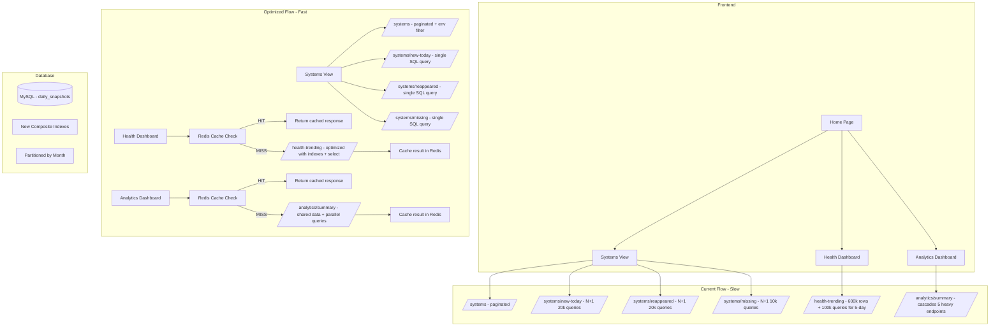

# Performance Optimization Plan - SEC Report Application

## Problem Statement
With ~20,000 rows inserted daily into the `daily_snapshots` table, all pages load slowly on production. After analyzing every query in the codebase, this plan identifies the root causes and provides actionable fixes.

## Data Scale Analysis
- **Daily inserts**: ~20,000 rows/day
- **30-day accumulation**: ~600,000 rows
- **90-day accumulation**: ~1,800,000 rows
- **Tables**: `systems` (unique systems), `daily_snapshots` (time-series data)
- **Database**: MySQL

---

## Critical Issues Found

### Issue 1: N+1 Query Loops (CRITICAL - Biggest Performance Killer)

Several endpoints execute individual queries inside loops, causing thousands of sequential database round-trips.

#### 1a. `getNewSystemsToday()` - N+1 Loop
**File**: [`systems.service.ts`](backend/src/modules/systems/systems.service.ts:317)
```
Lines 317-335: For EACH system in today's snapshot, executes a separate query
to check if it existed before. With 20k systems, this is 20,000+ queries.
```
**Fix**: Replace with a single SQL query using `LEFT JOIN` or `NOT IN` subquery.

#### 1b. `getMissingSystems()` - N+1 Loop  
**File**: [`systems.service.ts`](backend/src/modules/systems/systems.service.ts:404)
```
Lines 404-426: For EACH missing system, executes a separate query to find
its last snapshot. Could be thousands of individual queries.
```
**Fix**: Replace with a single bulk query using `GROUP BY shortname` with `MAX(importDate)`.

#### 1c. `getReappearedSystems()` - N+1 Loop
**File**: [`systems.service.ts`](backend/src/modules/systems/systems.service.ts:1573)
```
Lines 1573-1605: For EACH system in today's snapshot, queries for previous
snapshot individually. 20,000+ sequential queries.
```
**Fix**: Replace with a single query joining today's systems with their most recent previous snapshot.

#### 1d. `isConsecutivelyActive()` - N+1 Loop (called per system, per day)
**File**: [`systems.service.ts`](backend/src/modules/systems/systems.service.ts:752)
```
Lines 752-793: For EACH system, queries 5 separate days individually.
Called from calculateConsecutiveActiveMetrics which iterates ALL systems.
With 20k systems × 5 days = 100,000 queries!
```
**Fix**: Replace with a single aggregate query counting distinct dates per system.

#### 1e. `getFiveDayActiveDrillDown()` - Triple N+1 Loop
**File**: [`systems.service.ts`](backend/src/modules/systems/systems.service.ts:1066)
```
Lines 1066-1101: For EACH system:
  1. Calls isConsecutivelyActive (5 queries per system)
  2. Fetches 5-day history
Total: 20k × 5 + 20k = ~120,000 queries
```
**Fix**: Bulk-fetch all snapshots for the 5-day window, then process in memory.

#### 1f. `getSystemsByHealthCategory()` with category='new' - N+1 Loop
**File**: [`systems.service.ts`](backend/src/modules/systems/systems.service.ts:1430)
```
Lines 1430-1444: For EACH system, checks if it existed before today.
```
**Fix**: Use a single `NOT EXISTS` or `LEFT JOIN` query.

#### 1g. `calculateConsecutiveActiveHealthImprovement()` - N+1 Loop
**File**: [`systems.service.ts`](backend/src/modules/systems/systems.service.ts:935)
```
Lines 935-1012: For EACH consecutively active system, fetches start and end
snapshots individually. Two queries per system.
```
**Fix**: Bulk-fetch start and end snapshots for all systems at once.

---

### Issue 2: Missing Database Indexes (HIGH)

#### Current Indexes on `daily_snapshots`:
- `PRIMARY KEY (id)`
- Composite: `(shortname, importDate)`
- Single: `(importDate)`

#### Missing Indexes Needed:

| Index | Justification |
|-------|--------------|
| `(importDate, osFamily, serverOS)` | Nearly EVERY query filters by `osFamily = 'Windows'` AND `serverOS = 0/NULL/'False'`. Without this composite index, MySQL does full table scans on 600k+ rows. |
| `(env, importDate)` | Environment filtering is used on almost every endpoint when `env` parameter is provided. |
| `(shortname, importDate, osFamily, serverOS)` | Covering index for the most common query pattern: filter by shortname + date range + OS filters. |
| `(importDate, env, osFamily, serverOS, possibleFake)` | Covering index for dashboard queries that filter by date + env + OS + fake exclusion. |
| `(importDate, shortname)` on `daily_snapshots` | For the `MAX(importDate)` queries grouped by shortname. |

---

### Issue 3: Fetching All Columns When Only a Few Are Needed (HIGH)

#### 3a. `getHealthTrending()` - Fetches ALL 30+ columns for ALL snapshots
**File**: [`systems.service.ts`](backend/src/modules/systems/systems.service.ts:462)
```
Line 462: .getMany() fetches all columns for potentially 600,000 rows
(30 days × 20k/day). Only needs: shortname, importDate, r7Found, amFound,
dfFound, itFound, r7LagDays, amLagDays, dfLagDays, itLagDays, possibleFake.
```
**Fix**: Use `.select()` to only fetch needed columns, reducing data transfer by ~70%.

#### 3b. `getStabilityOverview()` and `getRecoveryTracking()` - Same issue
**File**: [`stability-scoring.service.ts`](backend/src/modules/analytics/services/stability-scoring.service.ts:483)
```
Line 483: .getMany() fetches all columns for bulk snapshot queries.
```
**Fix**: Select only the columns needed for health calculations.

#### 3c. `getSystemClassification()` - Fetches all columns for all snapshots
**File**: [`analytics.service.ts`](backend/src/modules/analytics/analytics.service.ts:117)
```
Line 117-127: Bulk fetches ALL snapshots with ALL columns.
```
**Fix**: Select only needed columns.

---

### Issue 4: `DATE()` Function Preventing Index Usage (HIGH)

Multiple queries use `DATE(snapshot.importDate) = DATE(:latestDate)` which wraps the column in a function, preventing MySQL from using the index on `importDate`.

**Affected queries in**:
- [`stability-scoring.service.ts:455`](backend/src/modules/analytics/services/stability-scoring.service.ts:455)
- [`stability-scoring.service.ts:735`](backend/src/modules/analytics/services/stability-scoring.service.ts:735)
- [`analytics.service.ts:89`](backend/src/modules/analytics/analytics.service.ts:89)
- [`systems.service.ts:378`](backend/src/modules/systems/systems.service.ts:378)

**Fix**: Replace `DATE(snapshot.importDate) = DATE(:latestDate)` with range queries:
```sql
snapshot.importDate >= :startOfDay AND snapshot.importDate < :startOfNextDay
```

---

### Issue 5: Repeated `MAX(importDate)` Queries (MEDIUM)

The `MAX(importDate)` query is executed at the start of nearly every endpoint:
- `getStats()`, `getNewSystemsToday()`, `getMissingSystems()`, `getHealthTrending()`, `getHealthySystemsForExport()`, `getUnhealthySystemsForExport()`, `getReappearedSystems()`, `getEnvironments()`, `getStabilityOverview()`, `getR7GapAnalysis()`, `getRecoveryTracking()`, `getSystemClassification()`, `getToolingCombinationAnalysis()`

That's **13+ identical queries** per page load.

**Fix**: Cache the latest import date in Redis with a short TTL (5 minutes). Since data only changes once per day during import, this is safe.

---

### Issue 6: `getAnalyticsSummary()` Cascading Redundant Queries (HIGH)

**File**: [`analytics.service.ts`](backend/src/modules/analytics/analytics.service.ts:446)
```typescript
// Lines 450-454: Calls 5 separate methods, each making their own DB queries
const overview = await this.stabilityScoringService.getStabilityOverview(days, env);
const r7Analysis = await this.getR7GapAnalysis(env);
const recoveryStatus = await this.getRecoveryStatus(days, env);
const classification = await this.getSystemClassification(days, env);
const toolingCombinations = await this.getToolingCombinationAnalysis(env);
```

Each of these methods:
1. Queries `MAX(importDate)` (5 times)
2. Queries all systems for latest date (5 times)
3. Queries all snapshots in date range (3 times for overview, classification, recovery)

**Fix**: 
- Fetch shared data once and pass it to each method
- Run independent queries in parallel with `Promise.all()`
- Cache intermediate results

---

### Issue 7: No Redis Caching for Expensive Endpoints (MEDIUM)

The project has Redis in its stack but no caching is implemented. These endpoints are expensive and their data only changes once per day:

| Endpoint | Estimated Query Count | Cache TTL |
|----------|----------------------|-----------|
| `/systems/health-trending` | 1 bulk query + in-memory processing + 100k+ queries for 5-day active | 15 min |
| `/analytics/summary` | 50,000+ queries (cascading) | 15 min |
| `/systems/new-today` | 20,000+ queries (N+1) | 15 min |
| `/systems/reappeared` | 20,000+ queries (N+1) | 15 min |
| `/systems/missing` | 10,000+ queries (N+1) | 15 min |
| `/systems/environments` | 1 query (cheap but called often) | 1 hour |

---

### Issue 8: Frontend Loading All Data Eagerly (MEDIUM)

**File**: [`Home.tsx`](frontend/src/pages/Home.tsx:49)
```typescript
// Lines 49-53: On every environment change, loads ALL of these simultaneously
useEffect(() => {
  loadNewSystemsToday();    // Triggers 20k+ queries
  loadReappearedSystems();  // Triggers 20k+ queries  
  loadMissingSystems();     // Triggers 10k+ queries
}, [selectedEnvironment]);
```

**Fix**: 
- Load data lazily (only when section is visible/expanded)
- Pass environment filter to backend instead of filtering client-side
- Use `Promise.all()` for parallel API calls

---

### Issue 9: Import Process Not Batched (MEDIUM)

**File**: [`import.service.ts`](backend/src/modules/import/import.service.ts:40)
```typescript
// Lines 40-48: Processes records one at a time
for (const record of records) {
  await this.processRecord(record, importDate);  // Individual INSERT per record
}
```

With 20k records, this means 20k individual `INSERT` statements plus 20k `SELECT` + `UPDATE/INSERT` for the systems table.

**Fix**: Use bulk insert with `INSERT ... ON DUPLICATE KEY UPDATE` and batch processing (chunks of 500-1000).

---

### Issue 10: No Data Archival Strategy (LOW - Long Term)

At 20k rows/day, the `daily_snapshots` table grows by ~7.3M rows/year. After 2 years, queries scanning date ranges will become increasingly slow.

**Fix**: 
- Implement table partitioning by month on `importDate`
- Archive data older than 6 months to a separate table
- Create summary/aggregate tables for historical trending

---

## Implementation Priority Order

### Phase 1: Database Indexes (Immediate Impact, Low Risk)
1. Add composite indexes for common query patterns
2. Replace `DATE()` function calls with range queries
3. **Expected improvement: 3-10x faster queries**

### Phase 2: Eliminate N+1 Queries (Highest Impact)
4. Refactor `getNewSystemsToday()` to single query
5. Refactor `getMissingSystems()` to single query  
6. Refactor `getReappearedSystems()` to single query
7. Refactor `isConsecutivelyActive()` to bulk query
8. Refactor `getFiveDayActiveDrillDown()` to bulk query
9. Refactor `calculateConsecutiveActiveHealthImprovement()` to bulk query
10. Refactor `getSystemsByHealthCategory()` new category to single query
11. **Expected improvement: 100-1000x fewer queries per request**

### Phase 3: Query Optimization
12. Add column selection (`.select()`) to all bulk queries
13. Deduplicate `MAX(importDate)` queries across endpoints
14. Refactor `getAnalyticsSummary()` to share data between sub-methods
15. Run independent sub-queries in parallel with `Promise.all()`
16. **Expected improvement: 50-70% less data transferred**

### Phase 4: Redis Caching
17. Cache `MAX(importDate)` result (5 min TTL)
18. Cache expensive endpoint results (15 min TTL)
19. Invalidate cache on new CSV import
20. **Expected improvement: Sub-second responses for cached data**

### Phase 5: Frontend Optimization
21. Pass `env` filter to backend APIs instead of client-side filtering
22. Lazy-load dashboard sections
23. Parallel API calls with `Promise.all()`
24. **Expected improvement: Faster perceived load times**

### Phase 6: Import & Long-term
25. Batch import processing (chunks of 500-1000)
26. Implement MySQL table partitioning by month
27. **Expected improvement: Faster imports, sustainable long-term performance**

---

## Architecture Diagram



---

## Detailed Query Refactoring Examples

### Example: `getNewSystemsToday()` - Before vs After

**BEFORE** (20,000+ queries):
```typescript
for (const shortname of shortnamesWithSnapshotsToday) {
  const previousSnapshot = await this.snapshotRepository
    .createQueryBuilder('snapshot')
    .where('snapshot.shortname = :shortname', { shortname })
    .andWhere('snapshot.importDate < :today', { today })
    .limit(1)
    .getOne();
  if (!previousSnapshot) {
    newSystems.push(system);
  }
}
```

**AFTER** (1 query):
```typescript
const newSystemShortnames = await this.snapshotRepository
  .createQueryBuilder('today')
  .select('today.shortname', 'shortname')
  .leftJoin(
    DailySnapshot,
    'prev',
    'prev.shortname = today.shortname AND prev.importDate < :today AND prev.osFamily = :osFamily AND (prev.serverOS = 0 OR prev.serverOS IS NULL OR prev.serverOS = :false)',
    { today, osFamily: 'Windows', false: 'False' }
  )
  .where('today.importDate >= :today', { today })
  .andWhere('today.importDate < :tomorrow', { tomorrow })
  .andWhere('today.osFamily = :osFamily', { osFamily: 'Windows' })
  .andWhere('(today.serverOS = 0 OR today.serverOS IS NULL OR today.serverOS = :false)', { false: 'False' })
  .andWhere('prev.id IS NULL')
  .groupBy('today.shortname')
  .getRawMany();
```

### Example: `isConsecutivelyActive()` - Before vs After

**BEFORE** (5 queries per system × 20k systems = 100,000 queries):
```typescript
for (const date of dates) {
  const snapshot = await this.snapshotRepository
    .createQueryBuilder('snapshot')
    .where('snapshot.shortname = :shortname', { shortname })
    .andWhere('snapshot.importDate >= :date', { date })
    .andWhere('snapshot.importDate < :nextDay', { nextDay })
    .getOne();
}
```

**AFTER** (1 query for ALL systems):
```typescript
const consecutiveCounts = await this.snapshotRepository
  .createQueryBuilder('snapshot')
  .select('snapshot.shortname', 'shortname')
  .addSelect('COUNT(DISTINCT DATE(snapshot.importDate))', 'activeDays')
  .where('snapshot.importDate >= :startDate', { startDate: fiveDaysAgo })
  .andWhere('snapshot.importDate <= :endDate', { endDate: today })
  .andWhere('snapshot.osFamily = :osFamily', { osFamily: 'Windows' })
  .andWhere('(snapshot.serverOS = 0 OR snapshot.serverOS IS NULL OR snapshot.serverOS = :false)', { false: 'False' })
  .andWhere('(snapshot.possibleFake = 0 OR snapshot.possibleFake IS NULL)')
  .groupBy('snapshot.shortname')
  .having('activeDays >= :days', { days: 5 })
  .getRawMany();
```

---

## Summary of Expected Impact

| Optimization | Current State | After Optimization | Improvement |
|-------------|--------------|-------------------|-------------|
| N+1 queries | 20,000-100,000 queries/request | 1-5 queries/request | 10,000x fewer queries |
| Missing indexes | Full table scans on 600k+ rows | Index seeks | 10-100x faster |
| DATE() function | Index bypass | Range queries using index | 5-10x faster |
| Column selection | All 30+ columns fetched | Only 8-10 needed columns | 70% less data |
| Redis caching | Every request hits DB | Cached for 15 min | Sub-second responses |
| Frontend parallel | Sequential API calls | Parallel + lazy loading | 2-3x faster page load |
| Import batching | 20k individual INSERTs | Bulk INSERT batches | 10-20x faster imports |
