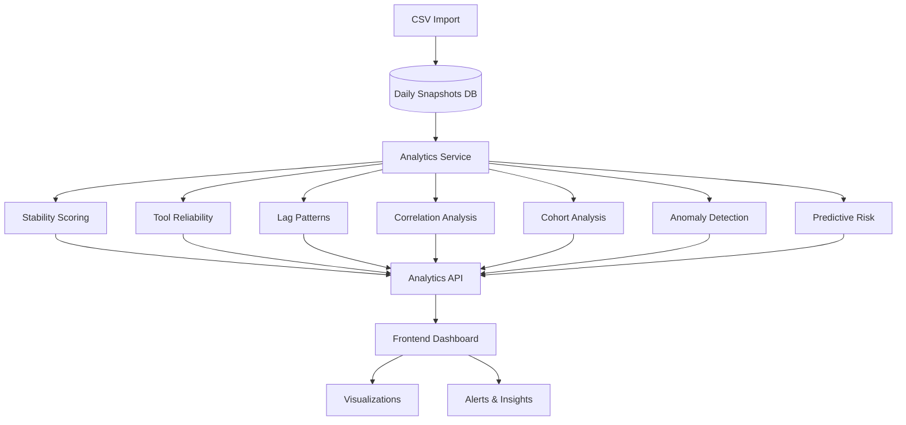

# Tool Health Analytics Enhancement Plan

## Problem Statement

The current dashboard shows tool health status but doesn't distinguish between:
- **Expected behavior**: Systems temporarily offline, normal check-in cycles, recovery periods
- **Real issues**: Persistent tool failures, configuration problems, systemic issues

### Key Challenges
1. **Rapid7 behavior**: Removes entries if system doesn't check in within 15 days (even if tool is installed)
2. **Recovery time**: Systems may take 1+ days to fully report after coming back online
3. **Flapping systems**: Systems that frequently fall in/out of health status
4. **Pattern identification**: Need to distinguish temporary issues from persistent problems

## Proposed Analytics & Insights

### 1. System Stability Scoring 🎯

**Purpose**: Identify systems with erratic vs stable health patterns

**Metrics to Calculate**:
- **Stability Score** (0-100): Based on health status consistency over time
  - 100 = Perfectly stable (no health changes)
  - 50 = Moderate flapping (changes every few days)
  - 0 = Highly unstable (changes daily)
- **Health Change Frequency**: Number of times health status changed in last 30 days
- **Consecutive Days Stable**: Current streak of same health status
- **Pattern Classification**:
  - `STABLE_HEALTHY`: Consistently healthy (90+ days)
  - `STABLE_UNHEALTHY`: Consistently unhealthy (needs attention)
  - `RECOVERING`: Recently improved and stabilizing
  - `DEGRADING`: Recently declined and worsening
  - `FLAPPING`: Frequent status changes (likely temporary offline/online cycles)

**Dashboard Display**:
- Stability score badge on system cards
- Filter systems by stability pattern
- "Flapping Systems" alert section (these are likely false positives)

---

### 2. Tool-Specific Reliability Metrics 🔧

**Purpose**: Identify which tools have consistent vs erratic reporting

**Metrics to Calculate**:
- **Tool Uptime %**: Percentage of days tool was reporting (last 30/60/90 days)
- **Average Lag Days**: Mean lag days when tool is reporting
- **Lag Day Volatility**: Standard deviation of lag days (high = erratic)
- **Reporting Gaps**: Number of times tool stopped reporting then resumed
- **Recovery Pattern**: Average days to resume reporting after a gap

**Per-Tool Analysis**:
```
Rapid7:
  - Uptime: 85% (26/30 days)
  - Avg Lag: 2.3 days
  - Volatility: High (σ=4.2)
  - Gaps: 3 occurrences
  - Avg Recovery: 1.2 days
  - Pattern: "Frequent short gaps - likely normal offline cycles"
```

**Dashboard Display**:
- Tool reliability cards with trend indicators
- Systems grouped by tool reliability patterns
- "Expected Gaps" vs "Concerning Gaps" classification

---

### 3. Lag Day Pattern Analysis 📊

**Purpose**: Distinguish temporary offline vs persistent issues

**Analysis Types**:

**A. Lag Day Trend Detection**:
- **Increasing Trend**: Lag days growing over time (system getting worse)
- **Stable High**: Consistently high lag days (persistent issue)
- **Cyclical Pattern**: Regular spikes and drops (normal offline/online cycle)
- **Sudden Spike**: Abrupt increase (investigate immediately)

**B. Rapid7-Specific Logic**:
- If R7 missing but Intune lag < 15 days → "Expected R7 gap (system recently offline)"
- If R7 missing and Intune lag > 15 days → "R7 should be missing (system inactive)"
- If R7 missing but AM/DF present → "Potential R7 configuration issue"

**C. Recovery Window Analysis**:
- Track systems that went offline and came back
- Measure time to full tool reporting (all 3 tools)
- Identify systems that take longer than expected (>2 days = investigate)

**Dashboard Display**:
- Lag day trend charts with pattern annotations
- "Expected Offline" vs "Needs Investigation" classifications
- Recovery time distribution histogram

---

### 4. Environment & OS Correlation Analysis 🌍

**Purpose**: Identify systemic issues affecting specific environments or OS types

**Correlations to Analyze**:
- **By Environment**: Which environments have higher unhealthy rates?
- **By OS Family**: Do certain OS types have more tool issues?
- **By OS Build**: Are specific builds problematic?
- **Cross-Environment Patterns**: Do issues affect all environments simultaneously?

**Statistical Analysis**:
- Chi-square test for environment/OS vs health status
- Identify statistically significant correlations
- Flag environments/OS types with >2σ deviation from mean

**Example Insights**:
```
⚠️ ALERT: Windows Server 2019 Build 17763 has 45% unhealthy rate
   (vs 12% average) - Possible systemic issue

✅ INFO: Production environment shows normal distribution
   No environment-specific issues detected
```

**Dashboard Display**:
- Environment health comparison matrix
- OS type breakdown with statistical significance indicators
- Correlation heatmap

---

### 5. Cohort Analysis 📅

**Purpose**: Track system behavior patterns over time

**Cohort Types**:

**A. Weekly Cohorts**:
- Group systems by week first seen
- Track health progression over subsequent weeks
- Identify if new systems follow expected onboarding pattern

**B. Health Status Cohorts**:
- Group systems by current health status
- Track how long they've been in that status
- Identify systems "stuck" in unhealthy state

**C. Recovery Cohorts**:
- Group systems that lost health in same week
- Track recovery rates and times
- Identify if issues are isolated or widespread

**Example Analysis**:
```
Week of Jan 20-26:
  - 15 systems lost health
  - 12 recovered within 2 days (80% - normal)
  - 3 still unhealthy after 7 days (20% - investigate)
```

**Dashboard Display**:
- Cohort retention/recovery charts
- "Systems Stuck in Unhealthy" alert
- New system onboarding success rate

---

### 6. Anomaly Detection 🚨

**Purpose**: Automatically flag unusual patterns requiring investigation

**Anomaly Types**:

**A. Statistical Anomalies**:
- Lag days > 3σ from system's historical mean
- Sudden drop in tool reporting across multiple systems
- Unusual health rate changes (>10% in single day)

**B. Pattern Anomalies**:
- System that was stable for 90+ days suddenly unhealthy
- All tools failing simultaneously (vs gradual failure)
- Environment-wide health drops

**C. Temporal Anomalies**:
- Weekend vs weekday patterns (systems offline on weekends?)
- Time-of-day patterns in lag days
- Seasonal trends

**Anomaly Scoring**:
- Severity: Low / Medium / High / Critical
- Confidence: How certain we are it's a real issue (vs expected behavior)
- Recommended Action: Investigate / Monitor / Ignore

**Dashboard Display**:
- Anomaly feed with severity indicators
- Anomaly timeline visualization
- Dismissed anomalies log (for learning)

---

### 7. Predictive Indicators 🔮

**Purpose**: Identify systems at risk before they lose health

**Risk Factors**:
- **Increasing Lag Days**: Gradual increase over 7+ days
- **Intermittent Tool Drops**: Tool reporting becoming less consistent
- **Environment Correlation**: Similar systems in same environment failing
- **Historical Pattern**: System has history of health loss

**Risk Score Calculation**:
```
Risk Score = (
  lag_trend_weight * lag_day_increase_rate +
  consistency_weight * (1 - reporting_consistency) +
  history_weight * past_failure_rate +
  environment_weight * environment_failure_rate
) * 100
```

**Risk Levels**:
- **High Risk** (80-100): Likely to lose health within 3 days
- **Medium Risk** (50-79): Monitor closely
- **Low Risk** (0-49): Normal operation

**Dashboard Display**:
- "At Risk Systems" section with risk scores
- Preventive action recommendations
- Risk trend over time

---

### 8. Root Cause Insights 🔍

**Purpose**: Help identify why systems are unhealthy

**Analysis Categories**:

**A. Tool-Specific Issues**:
- "Only R7 missing" → Check R7 agent/connectivity
- "Only AM missing" → Check Automox agent
- "Only DF missing" → Check Defender configuration
- "All tools missing" → System likely offline or network issue

**B. Timing Patterns**:
- "Lost health on weekend" → Possible scheduled maintenance
- "Lost health same day as 50 other systems" → Possible infrastructure issue
- "Gradual degradation" → Possible agent/service failure

**C. Historical Context**:
- "System has recovered from this 5 times before" → Likely temporary
- "First time unhealthy in 180 days" → Investigate immediately
- "Chronically unhealthy" → Needs remediation plan

**Dashboard Display**:
- Root cause suggestions on system detail pages
- Grouped issues (e.g., "15 systems with R7-only issues")
- Historical context tooltips

---

## Implementation Architecture

### Backend Components

```
backend/src/modules/analytics/
├── analytics.module.ts
├── analytics.service.ts          # Main analytics orchestration
├── analytics.controller.ts       # API endpoints
├── services/
│   ├── stability-scoring.service.ts
│   ├── tool-reliability.service.ts
│   ├── lag-pattern.service.ts
│   ├── correlation.service.ts
│   ├── cohort-analysis.service.ts
│   ├── anomaly-detection.service.ts
│   └── predictive.service.ts
└── dto/
    ├── analytics-request.dto.ts
    └── analytics-response.dto.ts
```

### New API Endpoints

```typescript
GET /api/systems/analytics/stability
  - Returns stability scores for all systems
  - Query params: env, days, minScore

GET /api/systems/analytics/tool-reliability
  - Returns tool-specific reliability metrics
  - Query params: tool, env, days

GET /api/systems/analytics/lag-patterns
  - Returns lag day pattern analysis
  - Query params: shortname, days

GET /api/systems/analytics/correlations
  - Returns environment/OS correlation analysis
  - Query params: env, days

GET /api/systems/analytics/cohorts
  - Returns cohort analysis data
  - Query params: cohortType, startDate, endDate

GET /api/systems/analytics/anomalies
  - Returns detected anomalies
  - Query params: severity, days, dismissed

GET /api/systems/analytics/at-risk
  - Returns systems at risk of losing health
  - Query params: minRiskScore, env

GET /api/systems/analytics/insights/:shortname
  - Returns comprehensive insights for a specific system
  - Includes stability, patterns, predictions, root causes
```

### Frontend Components

```
frontend/src/components/analytics/
├── AnalyticsDashboard.tsx        # Main analytics view
├── StabilityScoreCard.tsx        # System stability metrics
├── ToolReliabilityChart.tsx      # Tool-specific reliability
├── LagPatternChart.tsx           # Lag day trend visualization
├── CorrelationMatrix.tsx         # Environment/OS correlations
├── CohortAnalysisChart.tsx       # Cohort tracking
├── AnomalyFeed.tsx               # Anomaly alerts
├── AtRiskSystems.tsx             # Predictive warnings
└── SystemInsightsModal.tsx       # Detailed system analysis
```

---

## Data Flow Diagram



---

## Key Metrics Summary

### Dashboard Additions

**1. System Health Intelligence Panel**
- Stability Score Distribution
- Flapping Systems Count
- At-Risk Systems Count
- Anomaly Count (last 24h)

**2. Tool Reliability Panel**
- Per-Tool Uptime %
- Per-Tool Avg Lag Days
- Per-Tool Gap Frequency
- Reliability Trend (↑↓→)

**3. Pattern Insights Panel**
- Expected Offline Systems (R7 < 15 days)
- Needs Investigation (persistent issues)
- Recovery in Progress (< 2 days)
- Chronic Issues (> 7 days unhealthy)

**4. Environment Health Matrix**
- Health rate by environment
- Statistical significance indicators
- Correlation strength heatmap

**5. Predictive Alerts Panel**
- High Risk Systems (action needed)
- Medium Risk Systems (monitor)
- Recent Recoveries (success stories)

---

## Expected Outcomes

### Problem Resolution

**Before**: "We have 150 unhealthy systems - is this normal?"

**After**: 
- "85 systems are in expected R7 gap (recently offline, will recover)"
- "40 systems are flapping (normal offline/online cycles)"
- "15 systems have persistent issues (need investigation)"
- "10 systems are at high risk (preventive action needed)"

### Actionable Insights

1. **Reduce False Positives**: Identify systems with expected behavior vs real issues
2. **Prioritize Remediation**: Focus on systems with persistent/chronic issues
3. **Prevent Failures**: Act on at-risk systems before they lose health
4. **Identify Systemic Issues**: Spot environment/OS-specific problems
5. **Measure Success**: Track recovery rates and remediation effectiveness

---

## Implementation Phases

### Phase 1: Core Analytics (Backend)
- Stability scoring service
- Tool reliability metrics
- Lag pattern analysis
- Basic API endpoints

### Phase 2: Advanced Analytics (Backend)
- Correlation analysis
- Cohort tracking
- Anomaly detection
- Predictive risk scoring

### Phase 3: Frontend Visualization
- Analytics dashboard component
- Stability and reliability charts
- Pattern visualization
- At-risk systems panel

### Phase 4: Insights & Alerts
- Root cause suggestions
- Anomaly feed
- Predictive alerts
- Drill-down modals

### Phase 5: Refinement
- Tune thresholds based on real data
- Add user feedback mechanisms
- Implement alert dismissal/learning
- Performance optimization

---

## Success Metrics

- **Reduction in investigation time**: Faster identification of real issues
- **Improved accuracy**: Better distinction between expected vs problematic behavior
- **Proactive prevention**: Catch issues before systems lose health
- **Team confidence**: Clear understanding of what's happening in the environment
- **Reduced alert fatigue**: Focus on actionable insights vs noise
